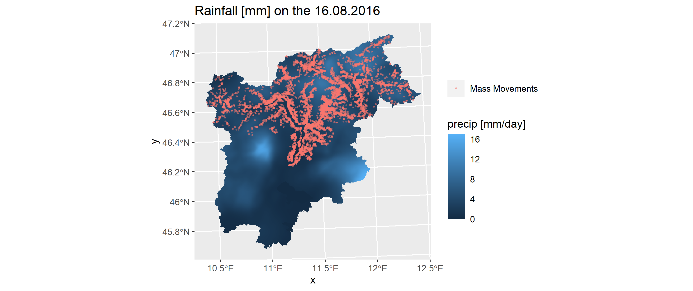

# rainfallR

## Installation

**gitlab**

```r

```
## Main Functionalities

***

### Get access to single NetCDFs

This package is intended to help a little bit in the extraction of the rainfall data from multiple NetCDF files stored in the right location. 

In order for this to work, the data needs to be organisd in a specific structure, that is more or less like this: 

```
PREC_GRIDS
├── 1980
│   ├── DAILYPCP_198001.nc
│   ├── DAILYPCP_198002.nc
│   ├── DAILYPCP_198003.nc
│   ├── DAILYPCP_198004.nc
```

- This means that the root-folder here is `PREC_GRIDS`
  + One level below are folders for all the years
    + and on the bottom-most level there are all the NetCDFs with the data for one month
 
    
- one can easily get the path to one raster with the function `get_nc_path` 

```r
data_path = "absolute_or_relative_path_to/PREC_GRIDs"
days_back = 1
day = as.Date("2009-01-20")
# will return:

# $`200901`
#[1] "absolute_or_relative_path_to/PREC_GRIDs2009/DAILYPCP_200901.nc"
```

***

### Extract data of NetCDFs for Vector data

- If one is interested in extracting the gridded rainfall-data that is intersecting with vector data one can use the function `rainfallR::get_rainfall()`

#### UPDATE (22.02.2021)

- It's better to use the function `rainfallR::ex_rainfall()` as the code within the function is clearer and the possibility exists to potentially pass multiple aggreagation-funtions when polygon data is used for the extraction

- For the extraction of *points** no aggreation is performed and the pixel value of the raster is extracted

- For *polygons** one can theoretically choose (at the moment only the mean) between multiple aggregation functions

- For the point data the package uses `raster::extract` and for the extraction and aggregation the package uses `exactextractr::exact_extract`


#### More help

- See [this vignette for more info](https://robinkohrs.github.io/rainfallR/articles/extract_landslide_rainfall.html)

***


